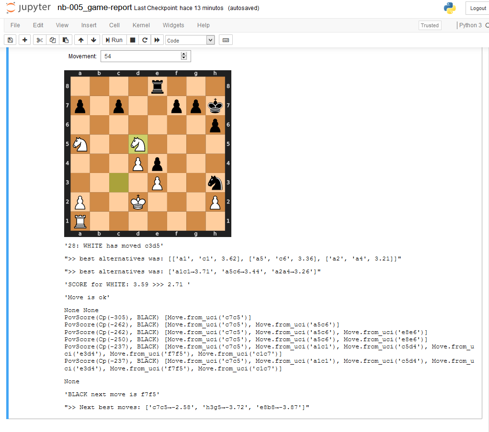
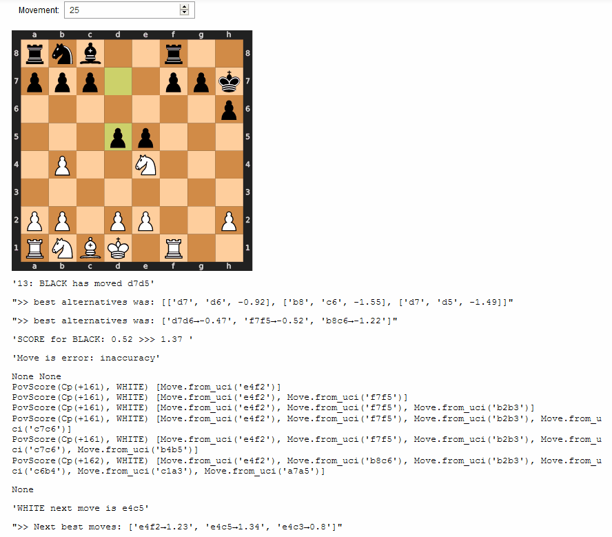
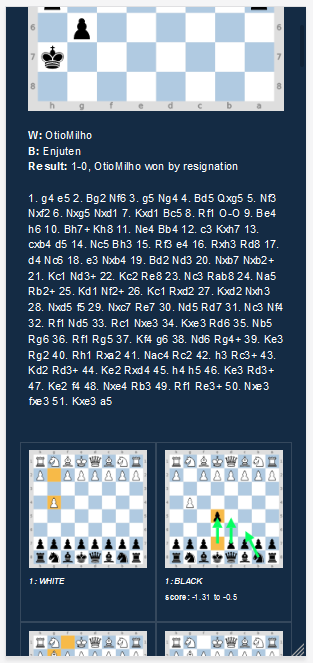

# data-wakes_chess
A collection of notebooks to explore and learn chess

## Description

- Explore and learn to use python chess and Stockfish engine
- Custom Utils
  - Chess
  - Engine
  - Html-report generator
- Game Review Notebook

## Install

Download stockfish_20090216_x64.exe 
  in .\notebooks\shared\stockfish_12_win_x64

## Overview

##### Game Review move-by-move

##### Game Report
Generate a static html output with a minimal responsive layout.

*Example*: http://motuo.info/chess/reports/lost-6546787425.html